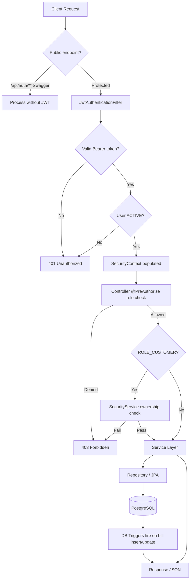
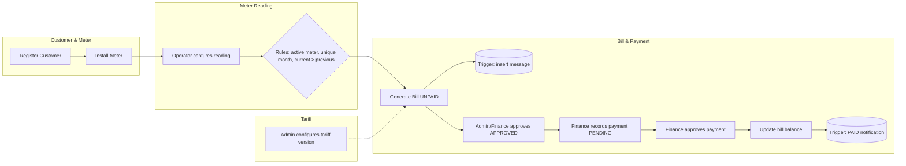
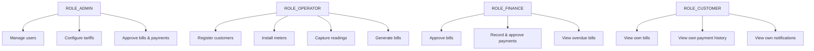

# Spring Boot Flow Diagram — Utility Billing System

**Assignment requirement:** Design a Spring Boot flow diagram showing system functionality.

## Request Flow (All Protected Endpoints)

## Billing Lifecycle

## Role Responsibilities

## Component Map

| Layer | Packages |
|-------|----------|
| Controllers | `auth`, `user`, `customer`, `meter`, `reading`, `tariff`, `bill`, `payment`, `penalty`, `message` |
| Services | Same domain packages + `security.SecurityService` |
| Security | `JwtAuthenticationFilter`, `SecurityConfig`, `CustomUserDetailsService` |
| Persistence | Spring Data JPA repositories |
| DB Routines | Flyway `V1__database_routines.sql` |
