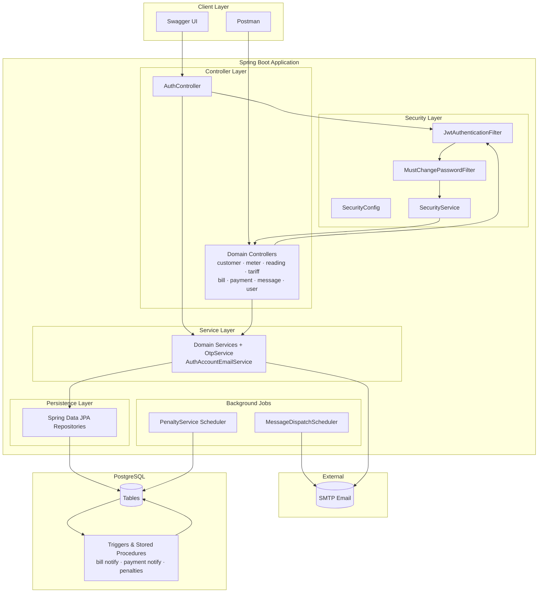
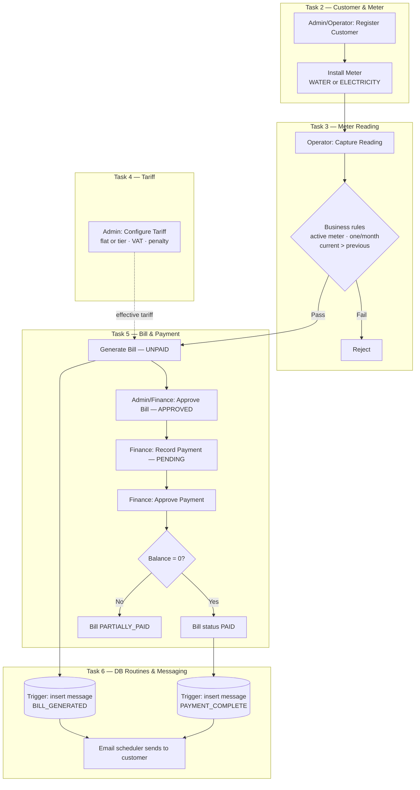
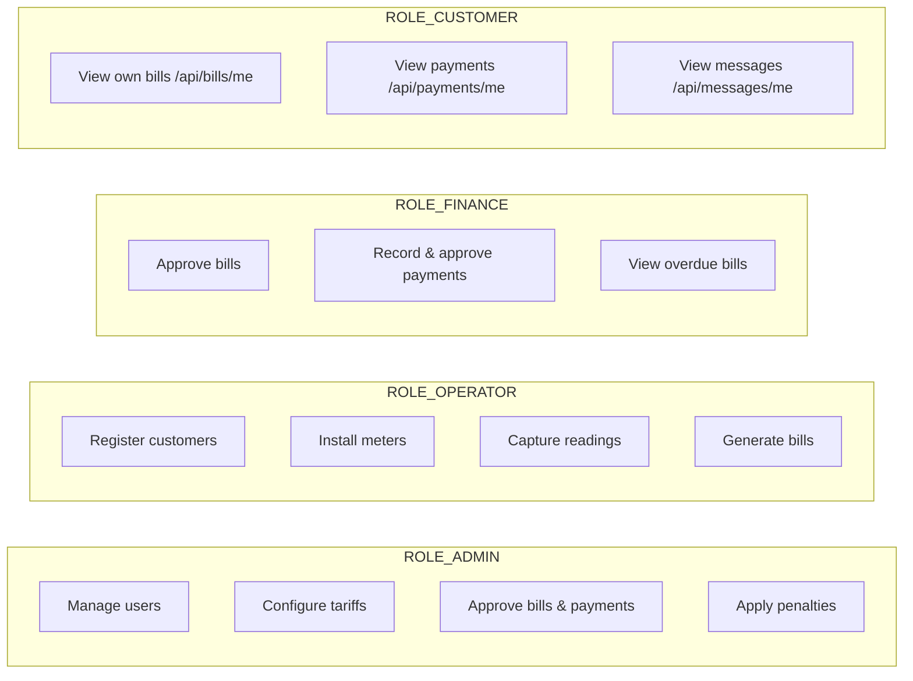

# Mermaid scripts — copy each block into https://mermaid.live

---

## 1. Spring Boot System Architecture (main submission diagram)



---

## 2. Authentication Flow (JWT + OTP)

```mermaid
flowchart TD
    START([User opens app]) --> LOGIN[POST /api/auth/login<br/>email + password]
    LOGIN --> VAL{Credentials valid?}
    VAL -->|No| E401[401 Unauthorized]
    VAL -->|Yes| OTP[OtpService sends 6-digit code by email]
    OTP --> VERIFY[POST /api/auth/otp/verify<br/>purpose: LOGIN]
    VERIFY --> VOK{OTP valid?}
    VOK -->|No| E400[400 Bad Request]
    VOK -->|Yes| JWT[Return JWT token]
    JWT --> MCP{mustChangePassword?}
    MCP -->|Yes| CPW[POST /api/auth/change-password]
    CPW --> API[Access protected APIs]
    MCP -->|No| API

    API --> HDR[Authorization: Bearer token]
    HDR --> FILTER[JwtAuthenticationFilter]
    FILTER --> ROLE[@PreAuthorize role check]
    ROLE --> OK([200 Response])
```

---

## 3. Billing Lifecycle (Tasks 2–6)



---

## 4. Role Responsibilities


